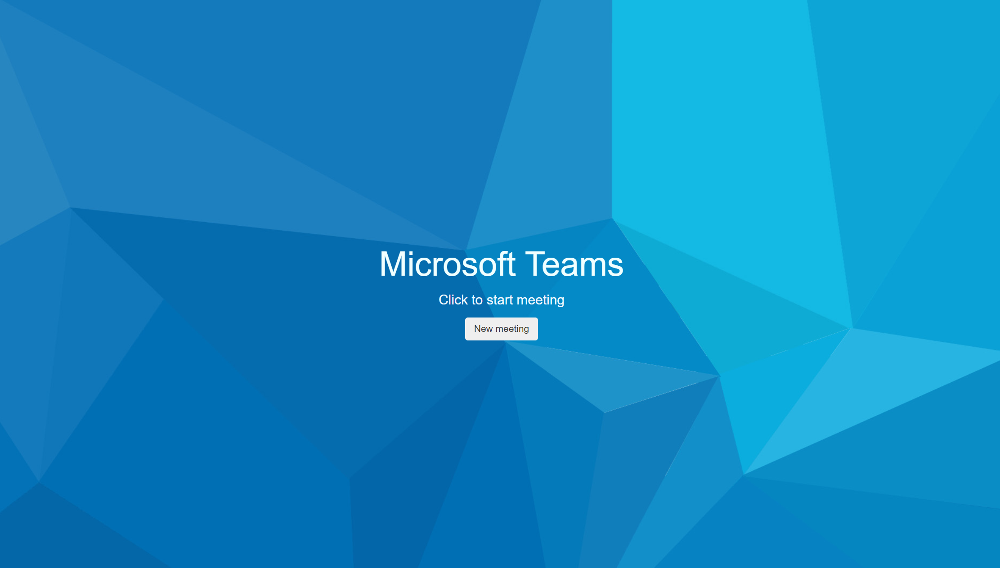
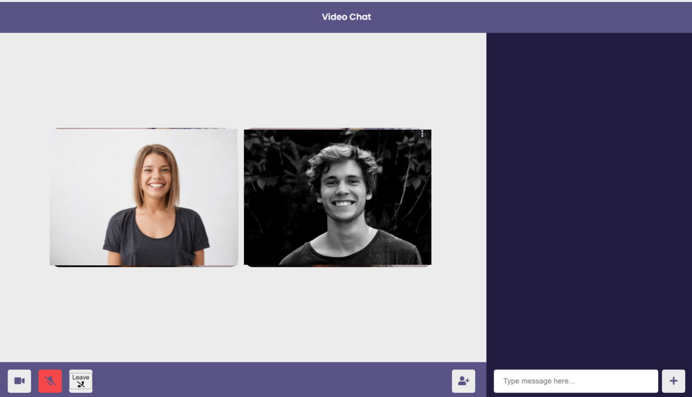

#   Microsoft teams clone
## Microsoft Engage'21 Project

This is a video chat web based application that allows you to do group video calling along with chat functionality.
This app is build using NodeJS, Socket.io, and Peerjs(WebRTC)
Check out the deployed version of the same below:
https://msteams11.herokuapp.com/

##  Design Documentation

https://github.com/NiharikaChhabra700/MSteams11/blob/main/Design%20Documentation.docx

## Screenshots

## Landing page

## Main page

